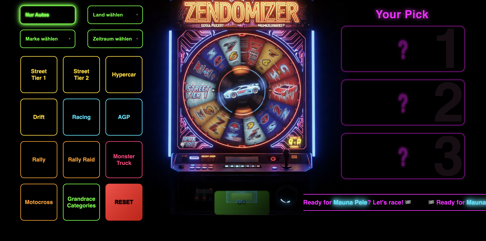
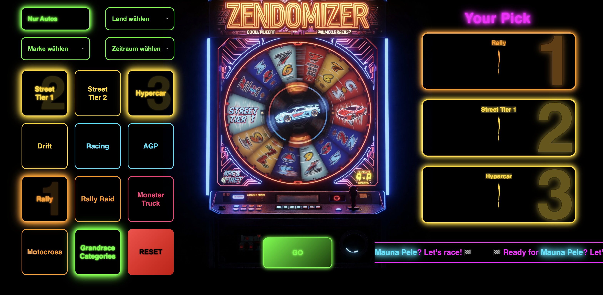
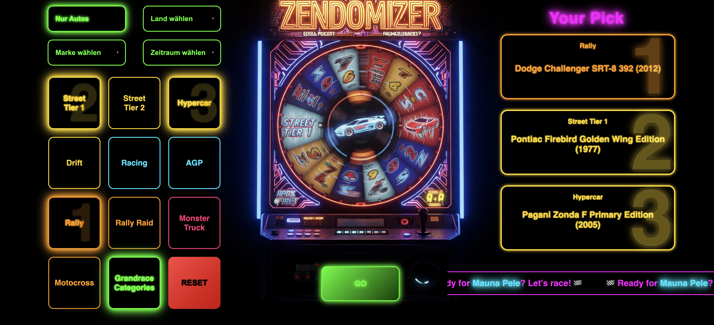
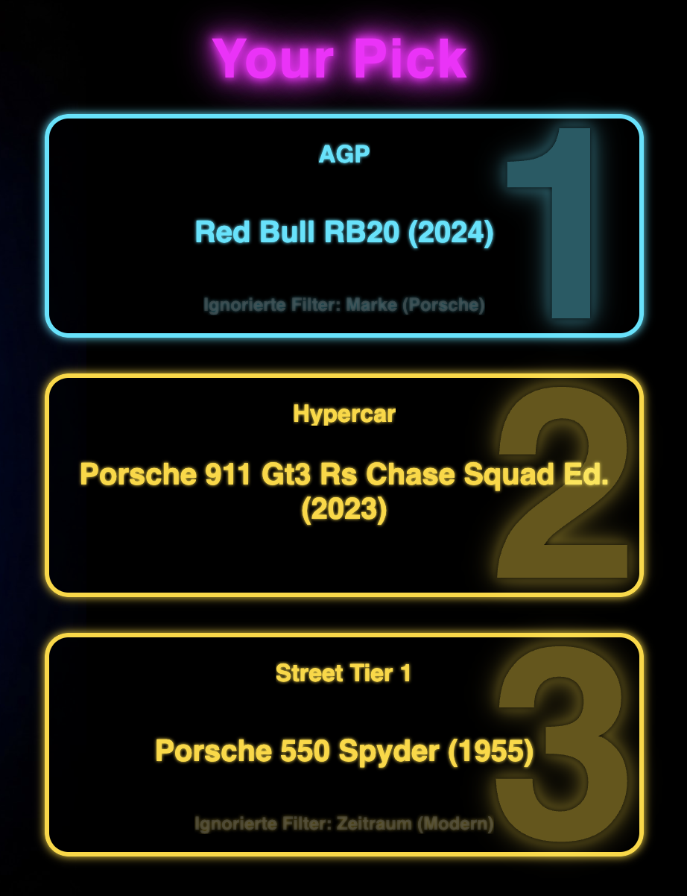
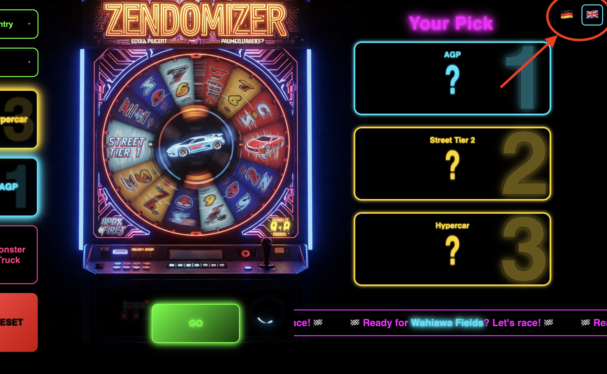

# **Randomizer for The Crew Motorfest Grand Races** *(click picture above to start)*

**Available categories**    
🚘 *Street Tier 1* 🚘 *Street Tier 2* 🚘 *Hypercar* 🚘 *Drift* 🚘 *Racing* 🚘 *AGP* 🚘 *Motocross* 🚘 *Rally* 🚘 *Rally Raid* 🚘 *Monster Truck* 🚘 

⚠️ *For Drift there are only a few cars available at the moment (Hoonigan & most Mitsubishi). This is because steering will block for most other drift cars when using direct mode or high dynamic maxlock. More cars may be added later.*

Thanks to [@wbcolon](https://github.com/wbcolon) for integrating the Grandrace rotation and automatic matching categories.  
And of course a special thank also to the [motorfe.st project](https://github.com/calamity-inc/motorfe.st/) for the rotation logic itself.

**Version:** v2.6  
**Carlist:** Season 6 – 21.05.2025

👉 Make sure to check out [Twitch](https://www.twitch.tv/xthepapapyr0) & [Discord](https://discord.gg/mJKXNPTG).

---

## 🔧 Core Features

- 🎰 **random picker** for The Crew Motorfest – perfect for having fun , doing challenges or streams - **keep the experience fresh**
- 🧠 **fully flexible** choose from several filters like country, brand or select just 2 categories to repeat the first selection (Rally --> Rally Raid --> Rally)
- 🔒 **rocking solid** if no filter matches, the filters are ignored one after the other - ignored filters are displayed
- 🏁 **Grandrace rotation** with automatic category selection (powered by motorfe.st) - can be de-/actived with the *Grandrace Catgerories* Button - Mainstage modifikator will be ignored ⚠️ *rotation on saturday is currently not working correctly because of changing modificators and routes* ⚠️ *routes may not always match correctly -in case please deactivate Grandrace Categories Button*
- 🎯 **advanced draw logic** with fallback system – ensures a valid result even with tight filters
- 🔁 **blacklist system** prevents repeats by writing a blacklit to browsers internal storage – with automatic reset when all options are drawn
- 🧹 **hotkeys for power users**:
  - `Shift + ?` – show help
  - `Shift + R` – reset blacklist & counter  
  - `Shift + X` – clear draw log  
  - `Shift + L` – show draw log in console  
- 📋 **copy to clipboard** - text output per category
- 🇬🇧/🇩🇪 **multilanguage support**
- 📲 **support for mobile phones**

---

## 🖼️ Screenshots

### 🏁 Startpage

### 🎯 Grandrace-Selection

### 🎰 ZENDomizer Selection "Your Pick"

### 🎰 ZENDomizer Selection "Your Pick" - only 2 categories selected

### 🎰 ZENDomizer Smart Filters - always get cars and see ignored filters

### Multi language - choose between german and english

### 📊 Log

