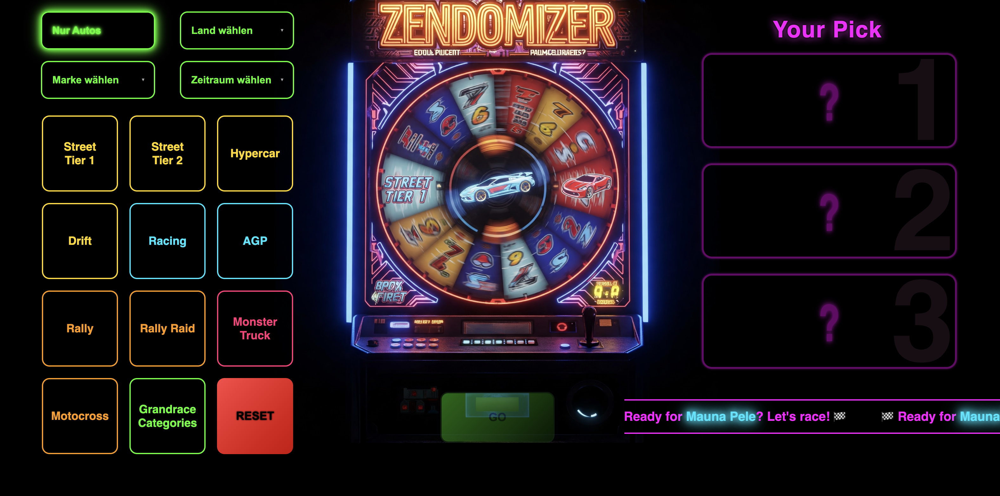
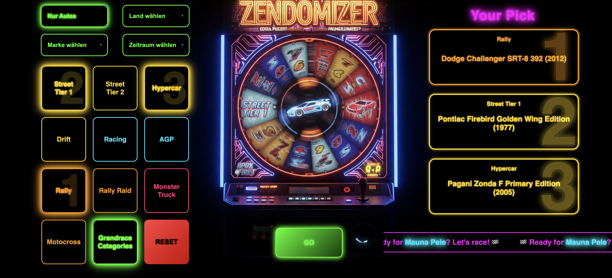
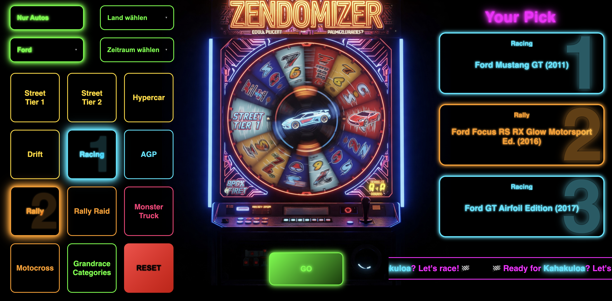
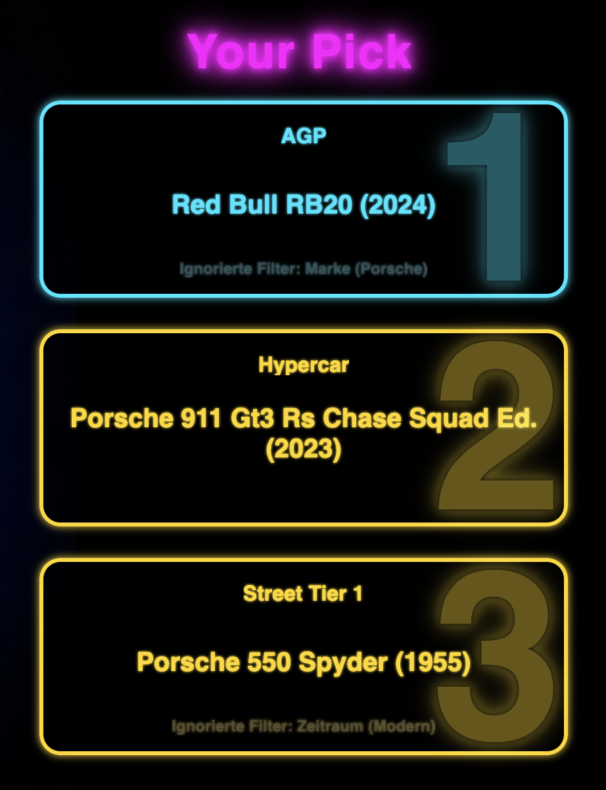
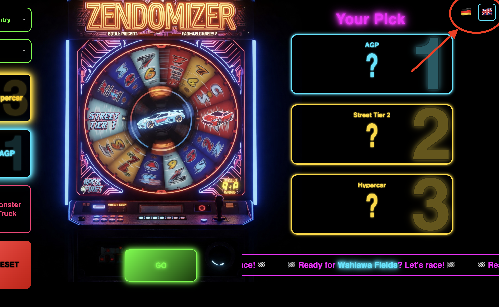
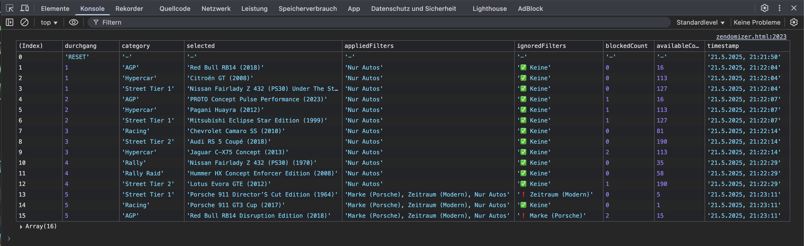

[](https://shogun160.github.io/TCM-ZEN_DOMIZER/zendomizer.html)

# **Randomizer for The Crew Motorfest Grand Races** *(click picture above to start)*

**Available categories** *(TIP: Sort your vehicles by brand)*  
🚘 Street Tier 1 🚘 Street Tier 2 🚘 Hypercar 🚘 Drift 🚘 Racing 🚘 AGP 🚘 Motocross 🚘 Rally 🚘 Rally Raid 🚘 Monster Truck 🚘

⚠️ *For Drift there are only a few cars available at the moment (Hoonigan & most Mitsubishi). This is because steering will block for most other drift cars when using direct mode or high dynamic maxlock. More cars may be added later.*

Thanks to [@wbcolon](https://github.com/wbcolon) for integrating the Grandrace rotation and automatic matching categories.  
And of course a special thank also to the [motorfe.st project](https://github.com/calamity-inc/motorfe.st/) for the rotation logic itself.

**Version:** v2.7
**Carlist:** Season 10 – 05.10.2026

👉 [Twitch](https://www.twitch.tv/xthepapapyr0) & [Discord](https://discord.gg/mJKXNPTG).

---

## 🔧 Core Features

- 🎰 **random picker** for The Crew Motorfest – perfect for having fun , doing challenges or streams - **keep the experience fresh**
- 🧠 **fully flexible** choose from several filters like country, brand or select just 2 categories to repeat the first selection (Rally --> Rally Raid --> Rally)
- 🔒 **rocking solid** if no filter matches, the filters are ignored one after the other - ignored filters are displayed
- 🏁 **Grandrace rotation** automatic category selection (powered by motorfe.st) - can be de-/actived with the *Grandrace Catgerories* Button - current modifier and grnad race route will also be shown ⚠️ *routes may not always match correctly - in case please deactivate Grandrace Categories Button*
- 🎯 **advanced draw logic** with fallback system – ensures a valid result even with tight filters
- 🔁 **blacklist system** prevents repeats by writing a blacklit to browsers internal storage – with automatic reset when all options are drawn
- ⚙️ **available filters:**
  - 🚗 only cars / 🔝 top tier cars / 🏍️ only bikes / 🚙 all vehicles  
  - 🌍 country  
  - 🏷️ brand  
  - ⏳ era (classic / modern)
- 🧹 **hotkeys for power users** (inactive while typing in a text field):
  - `Enter` – start a draw, same as the GO button
  - `Shift + ?` – show help
  - `Shift + R` – reset blacklist & counter  
  - `Shift + X` – clear draw log  
  - `Shift + L` – show draw log in console (keeps the last 500 entries)
  - `Shift + G` – toggle dev logging
  - `C` – copy draw to clipboard again
- 📋 **automatic copy to clipboard** - text output per category
- **Twitch INtegration** - connect the ZENdomizer directly with you Twitch account / chatbox
- 🇩🇪/🇬🇧 **multilanguage support** - german/english
- 📲 **support for mobile phones**

---

## 🖼️ Screenshots

### 🏁 Startpage


### 🎰 ZENDomizer Selection "Your Pick"


### 🎰 ZENDomizer Selection "Your Pick" - only 2 categories selected


### 🎰 ZENDomizer Smart Filters - always get cars and see ignored filters


### Multi language - choose between german and english


### 📊 Log (`Shift + L`)


---

## 🔄 Updating the Grand Race rotation

The rotation lives **only** in `zendomizer.html` — two constants near the top of the
script block:

- `ROTATION_START` — unix timestamp of the moment the first entry of the list starts
- `ROTATION` — one entry per slot: `[ track, "Cat > Cat > Cat", modifier? ]`
- `EVENT_DURATION` — currently 10 minutes per slot

A season sync means replacing both `ROTATION_START` and the whole `ROTATION` array
(source so far: tunerfest.app/grand-race). Categories are mapped to the checkboxes via
`ROTATION_MAP`; `Jet` has no checkbox and stays a virtual slot filled with `JET_VEHICLE`.
Modifiers come with the rotation and apply on every day of the week.

After a sync, run the tests — they walk every entry and will flag an unknown category
key or a broken slot order:

```bash
node tests/grandrace-rotation.test.mjs
```

Note: the rotation *logic* is borrowed from [motorfe.st](https://github.com/calamity-inc/motorfe.st),
but that project stopped updating its schedule after Season 6 (March 2025) — its data
(24 slots à 20 minutes) does not match the current game any more.

---

## 🧪 Tests

Draw logic regression tests — plain Node, no dependencies:

```bash
node tests/run.mjs
```

They cut the real functions out of `zendomizer.html` and run them against
`cars/vehicles.json`, so they test the shipped code rather than a copy. Set
`ZENDOMIZER_HTML` to check a different revision, e.g. to confirm a test
actually catches the bug it covers:

```bash
git show HEAD~1:zendomizer.html > /tmp/before.html
ZENDOMIZER_HTML=/tmp/before.html node tests/run.mjs
```

The Twitch worker has its own suite: `cd twitch-bot && npm test`.
