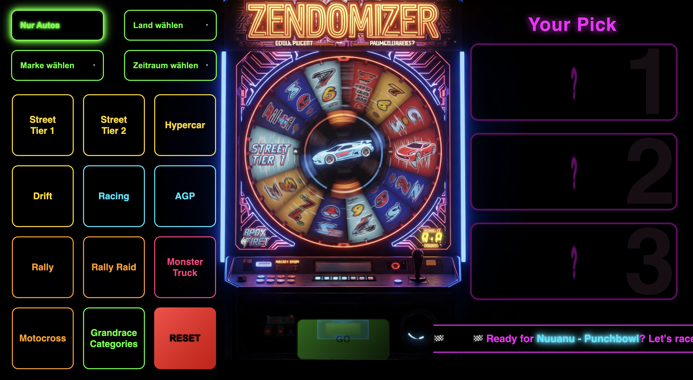
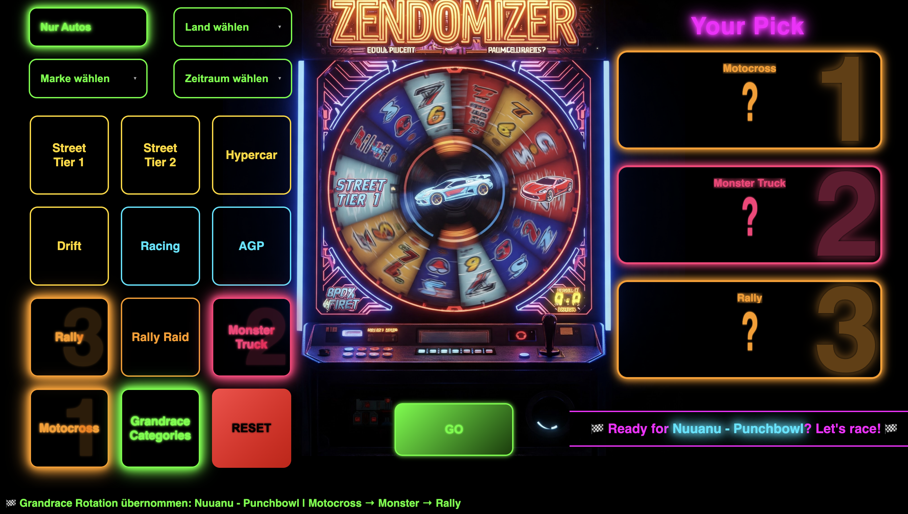
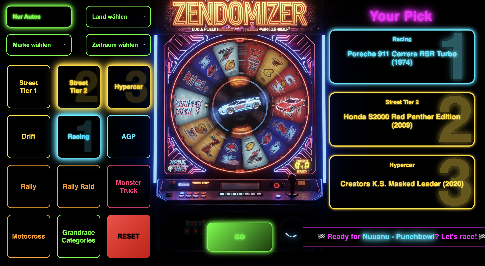
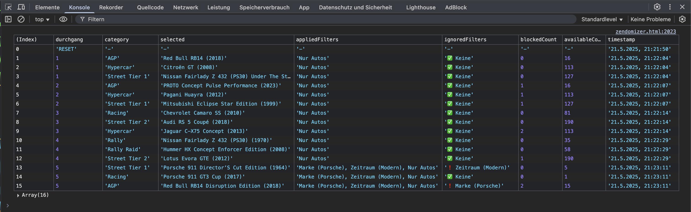

# **Randomizer for The Crew Motorfest Grand Races** (click picture to start)

Available categories:
- Street Tier 1
- Street Tier 2
- Hypercar
- Drift
- Racing
- AGP
- Motocross
- Rally
- Rally Raid
- Monster Truck

⚠️ *For Drift there are only a few cars available at the moment (Hoonigan & Mitsubishi). This is because steering will block for most other drift cars when using direct mode or high dynamic maxlock. More cars may be added later.*

Thanks to [@wbcolon](https://github.com/wbcolon) for integrating the Grandrace rotation and automatic matching of categories.  
And of course to the [motorfe.st project](https://github.com/calamity-inc/motorfe.st/) for the rotation logic itself.

**Version:** v2.4  
**Carlist:** Season 6 – 21.05.2025

👉 Make sure to check out [Twitch](https://www.twitch.tv/xthepapapyr0) & [Discord](https://discord.gg/mJKXNPTG)

---

## 🔧 Core Features

- 🎰 **Random Picker** for The Crew Motorfest – perfect for having fun , doing challenges or streams
- 🏁 **Grandrace rotation** with automatic category selection (powered by motorfe.st) - Mainstage modifikator will be ignored
- 🎯 **Advanced draw logic** with fallback system – ensures a valid result even with tight filters
- 🔁 **Blacklist system** prevents repeats – with automatic reset when all options are drawn
- 🧹 **Hotkeys for power users**:
  - `Shift + R` – Reset blacklist & counter  
  - `Shift + X` – Clear draw log  
  - `Shift + L` – Show draw log in console  
  - `Shift + ?` – Show help  
- 📋 **Copy to clipboard** - text output per category

---

## 🖼️ Screenshots

### 🏁 Startpage

### 🎯 Grandrace-Selection

### 📋 ZENDomizer Selection "Your Pick"

### 📊 Log

